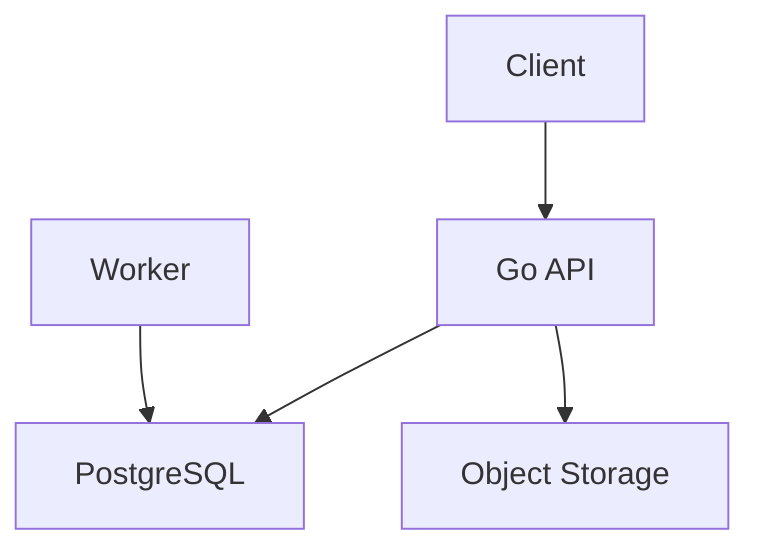

# {Feature Name} 설계 문서

## 1. 개요
- **기능명**: {feature-name}
- **계획서**: [plan.md](../01-plan/features/{feature-name}.plan.md)
- **작성일**: {YYYY-MM-DD}
- **활성 기준**: Go + PostgreSQL + Modular Monolith

## 2. 아키텍처

### 2.1 시스템 구조


### 2.2 컴포넌트 설계
| 컴포넌트 | 역할 | 비고 |
|----------|------|------|
| API | 사용자 요청 처리 | public boundary |
| Worker | 배치/알림/계산 | same codebase |
| DB | 트랜잭션 SSOT | PostgreSQL |

## 3. API 설계

### 3.1 엔드포인트
| Method | Path | 설명 |
|--------|------|------|
| GET | /api/v1/{resource} | |
| POST | /api/v1/{resource} | |

### 3.2 요청/응답 스키마
- active canonical OpenAPI와 정합성 유지
- legacy Spring/Django split 경계는 기본 가정으로 사용하지 않음

```json
{
  "data": {}
}
```

## 4. 데이터 설계

### 4.1 엔티티
| 엔티티 | 설명 | 주요 필드 |
|--------|------|----------|
| | | |

### 4.2 데이터 패턴
- append-only 원장 여부
- projection 필드 여부
- idempotency key 필요 여부
- 상태 enum canonical 일치 여부

## 5. 프론트엔드 설계

### 5.1 화면 구성
| 화면 | 경로 | 컴포넌트 |
|------|------|----------|
| | | |

### 5.2 WDS 컴포넌트 사용
- [ ] Button
- [ ] Card
- [ ] Form
- [ ] BottomSheet
- [ ] BrixBadge
- [ ] Motion

## 6. WooriDo 도메인 규칙 적용

### 6.1 상태 모델
- Challenge: RECRUITING / IN_PROGRESS / COMPLETED
- Meeting: VOTING / CONFIRMED / COMPLETED / CANCELLED
- Vote: PENDING / APPROVED / REJECTED / EXPIRED / CANCELLED

### 6.2 금융 모델
- append-only 원장
- idempotency key
- `expense_execution_sessions` 또는 동등한 실행 모델

### 6.3 당도(Brix)
- 기본값 12
- 납입당도 x 0.7 + 활동당도 x 0.15
- 상한 80

## 7. 테스트 계획
- [ ] 단위 테스트
- [ ] 통합 테스트
- [ ] E2E 테스트
- [ ] canonical 정합성 검사

## 8. 다음 단계
- [ ] 구현 완료 후 `/pdca-analyze {feature-name}` 실행
